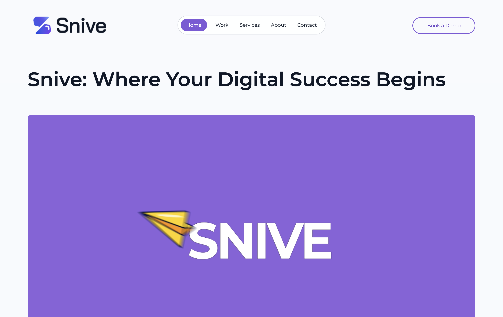

# Snive Technologies Pvt Ltd Official Website
This is a website project made with react - typescript - tailwind CSS.

## Getting Started
To get the project up and running on your local machine, follow these steps:

Prerequisites : Node.js and npm installed on your system.

Installation : Clone the repository
Navigate to the project directory
Install dependencies: npm install 
Start the development server: npm run dev

Usage : Once the development server is running, access the dashboard in your browser at http://localhost:5173. Explore the various features and functionalities available within the dashboard interface.

## Acknowledgements
Special thanks to "Snive.io" for giving the opportunity to work on this project and showcase my React based development skills.